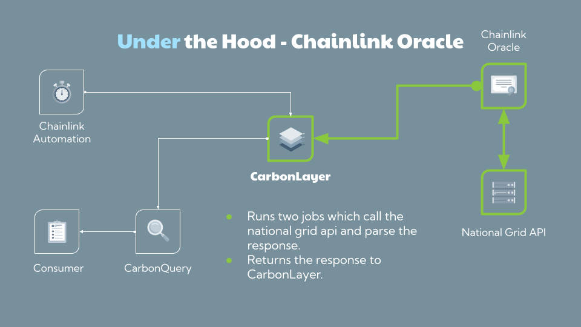

# Chainlink

## Inspiration
We wanted to introduce the capability for  blockchain protocols to behave based on  the carbon footprint that they are incurring.  While the protocols run in a decentralised way so it’s not clear where the energy they use is coming from, the protocols can be used to control off-chain work where the energy supply is known

## What it does
CarbonLayer provides an oracle and smart contracts to allow other contracts to change their behaviour based on whether the action is going to occur during a period of high carbon intensity or low carbon intensity. For example, a contract that is a gateway for issuing work for a service that consumes a lot of electricity could be made to only allow access to the service when the carbon intensity is low or to change fees for the service if the electricity will be generated using a non-renewable source.
How we built it
CarbonLayer was built iteratively starting with accessing the United Kingdom’s National Grid API and then building a contract and jobs to feed this into the CarbonLayer contract. We then built another pair of contracts CarbonAssert and CarbonQuery to allow other contracts to access the data through modifiers to allow prohibiting access or changing behaviour.

We also created a couple of examples in Remix:
* Price adjusted access to off-chain compute resources through Chainlink Functions where there is a discount for accessing the function when the carbon intensity is low
* Dynamic Fee adjustment hook for Uniswap pools that want to provide different fees

## Challenges we ran into

* APIs for getting carbon intensity are very localised and different per country/region.  Given the time restrictions of the hackathon we decided to pick one country rather than try working out global carbon intensity or providing multiple country specific information to simplify the system.
* Parsing the json in the job isn’t as flexible as would have hoped - can’t use things like XPath or similar with jsonparse
* Uniswap V4 isn’t yet deployed to Sepolia so the Uniswap hook could only be developed using the sandbox.

## Accomplishments that we're proud of

We provide real-time data on-chain for smart contracts to alter their behaviour based on their carbon footprint.
We created sample integrations that demonstrate the use of CarbonLayer.
This has proved to be a viable route for contracts to work with and should be extended.

During the hackathon Microsoft announced that they are doing something similar with Windows Update to apply them when the carbon intensity is low on each machine, which validates our aspirations.

## What we learned

* Chainlink is easy to work with.
* Install and configuration of Chainlink node through Docker
* Configuring and accessing oracle, including the price of execution through Chainlink automation. Plus reducing gas for the update.
* Chainlink functions and calling AWS Lambda
* What Uniswap 4 hooks are and how they work\how to write them.

## What's next for Carbon Layer
* Investigate looking at other APIs that are available to get per-country (and/or region) electricity generation statistics and provide contracts with modifiers that allow the same sort of customisation.
* Investigate creating a proxy contract that can be used to wrap existing contracts, allowing the carbon intensity checks to be added to existing contracts without having to modify the contract itself.
* Consider graduated fee adjustments for different carbon intensities.
* Link up to distributed compute systems like Render and Live Peer to allow work to be accepted for only when the carbon intensity is low.
* Investigate use of CCIP to distribute the oracle values to other chains (comparing the costs both in execution time and execution costs to implementing another oracle on other chains).
* More example integrations and unit and integration tests
